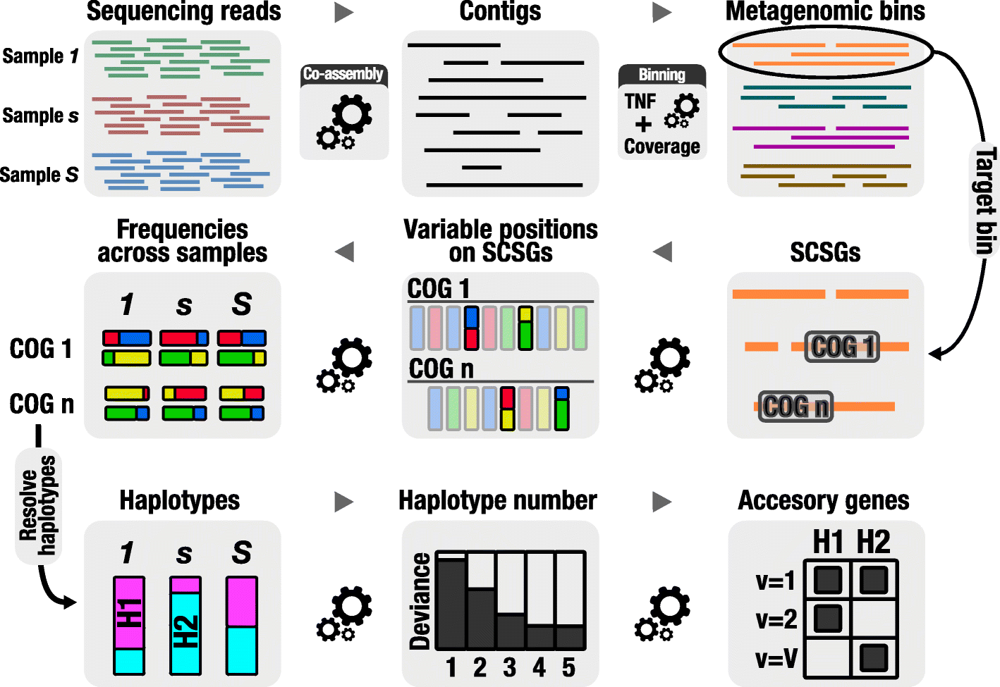
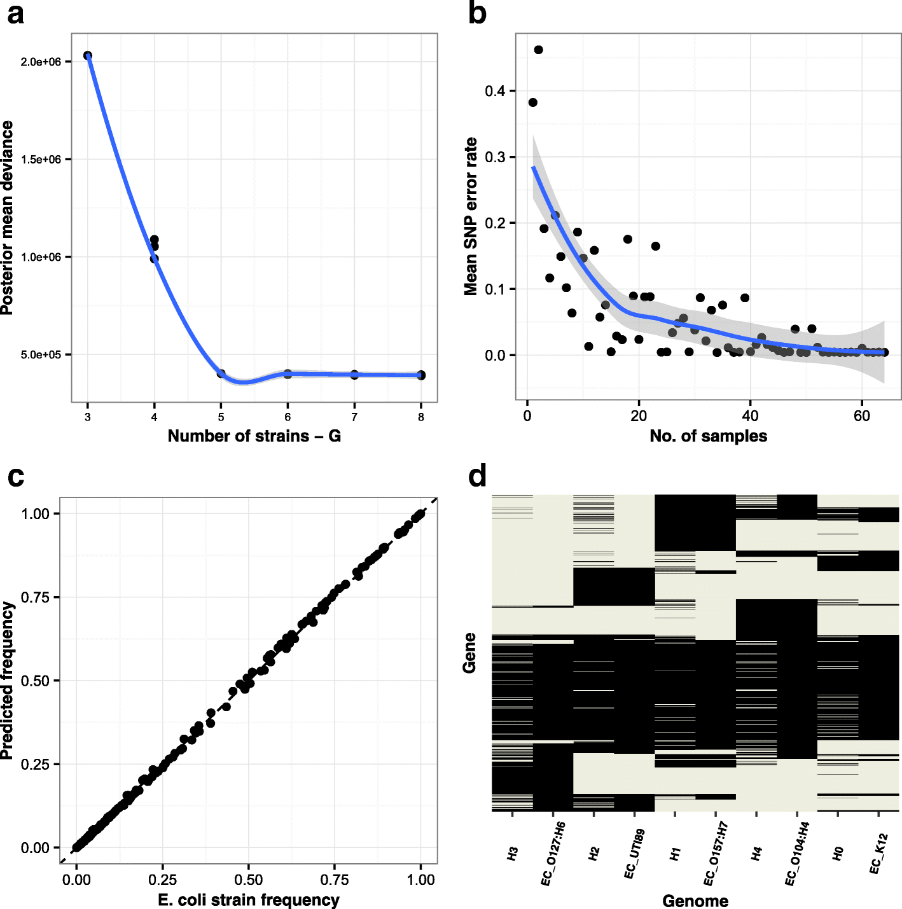
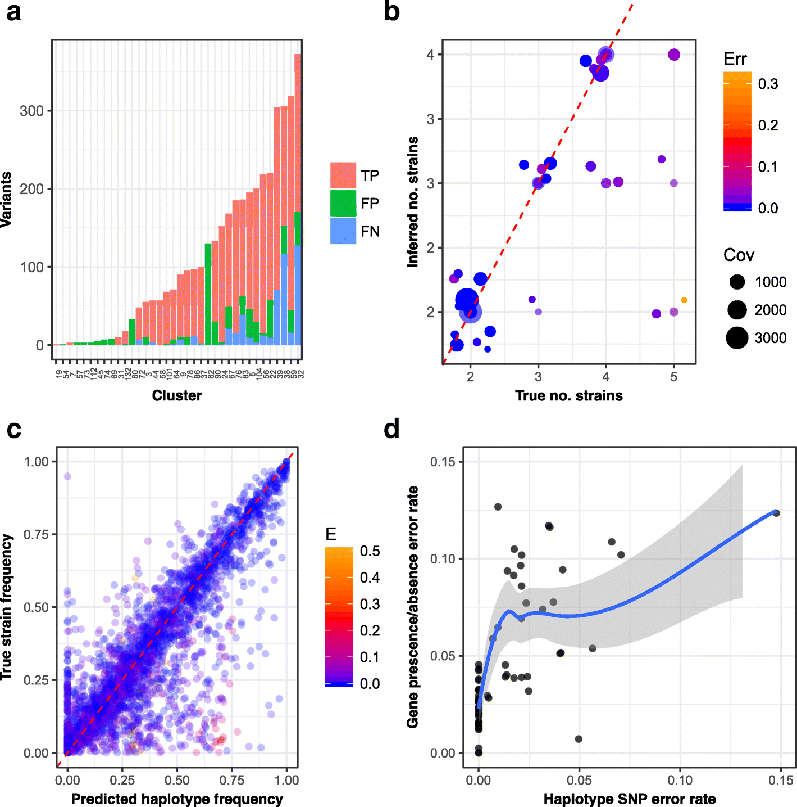
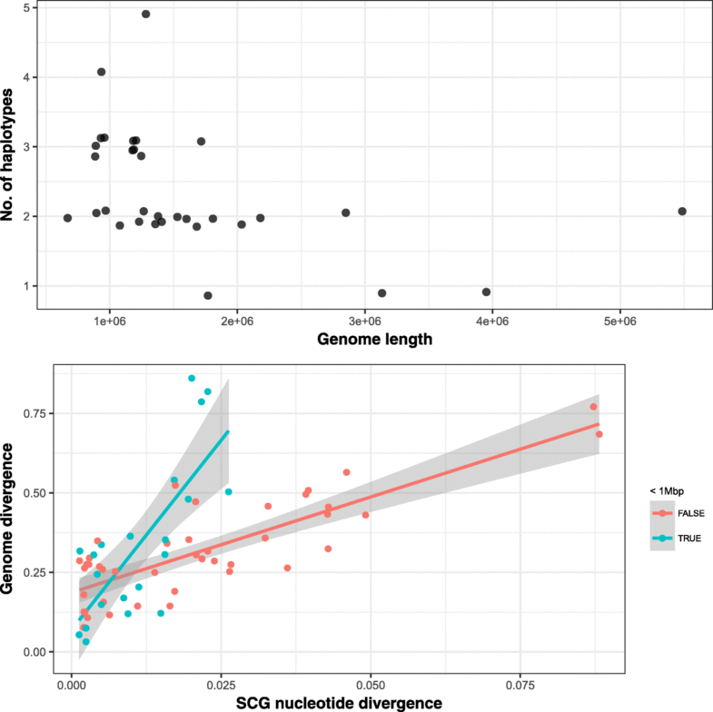
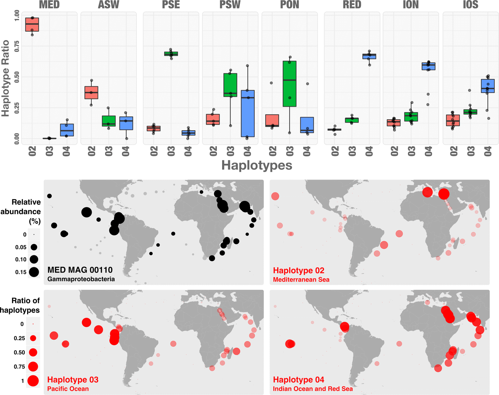

MtlMicro Meeting: December 2017
Quince et al., 2017

"DESMAN: a new tool for de novo extraction of strains from metagenome" by Quince et al. 2017
========================================================
author: Patricia Tran
date: December 6, 2017
autosize: true

WELCOME!
========================================================
Welcome to the First MtlMicro Meeting!
Thank you all for attending and for the paper suggestions.

This paper was suggested by Nicolas Tromas from the Shapiro Lab. 

ABSTRACT
========================================================

Problem:
Large multi-sample metagenomes are generated, but strain variation results in fragmentary co-assemblies
Therefore, the bins (MAGs) are can be an aggregate of closely related strains.

What DESMAN is:
a tools that identifies varients in core genes and uses co-occurence accross samples to link these variants into haplotypes and abundance profiles

How this was tested:
- in silico
- A complex 50-species 210-genome 96-samples synthetic mock data set and applied to the Tara Oceans Microbiome

The basics...What's a metagenome?
========================================================
A metagenome is a genome reconstructed (metagenome-assembled-genomes, or MAGs, or bin) from all the DNA extracted from an environmental sample.

Overview of the DESMAN pipeline
====================================

Figure 1.

Some key terms
====================================
>"We developped a full **Bayesian Model**, fitted by a **Markov Chain Monte Carlo (MCMC)** **Gibbs sampler**, to learn the strain frequencies, their **haplotypes** and allso sequencing error rates. To improve **convergence**, we initialize the Gibbs sampler using a **non-negative matrix factorisation** (NMF), or more properly **non-negative tensor factorisation (NTF)**, a method from machine learning that is equivalent to the **maximum likelihood solution**" 

(Second page of PDF, Quince et al. 2017)

Definitions
====================================
Bayesian Model:

**MCMC**: A method to sample from and to computing expectations with high-dimensional probability distributions. Check out this video <https://www.youtube.com/watch?v=12eZWG0Z5gY> for an intro to it.

Gibbs Sampler: One type of MCMC. 

Convergence:

Non-negative matrix factorisation:

Non-negative tensor factorisation:

Maximum-likelihood:

DESMAN model testing
====================================

Figure 2

E.coli O104:H4 outbreak
====================================
Applied the algorithm to 53 human feacal samples from the 2011 STEC O104:H4 outbreak

Starting point: 
- unknown number of exact strains present in the population nor their proportions
- We know one of these strains, from cultured isolate that was sequenced.
- Can we use DESMAN to find/predict that particular strain?

A few points:
20 samples were used because they had mean coverage of SCSG (Single core genes) greater than 5. Smaller than that is hard to deconvolute.

Validation of reconstructed strains 
====================================

Figure 3

Figure 4
====================================

Figure 5
====================================

TARA Oceans plankton microbiome survey
====================================
7.2 TB of metagenomic data, 243 samples accross 68 locations from epipelagic and mesopelagic waters globally

- No attemps to bin into MAGs in the original study
- Delmont et al., 2011 : Extracted 957 MAGs from 93 of these samples (Using CONCOCT and ANVI'O)
    + 32 of the most abundant MAGS with 75% of SCG %>% DESMAN
    + 4 Actinobacteria, 6 Bacteroidetes, 1 *Candidatus Marinimicrobia*, 1 Chloroflexi, 3 Euryarchaeota and 17 Proteobacteria

Figure 6
====================================

Open-ended discussion
====================================
Example questions to discuss:

- In which scenarios would deconvoluting MAGs be useful? For what kind of questions?
- Would this method can useful in your research?
- What binning algorithm do you use for your research? What are the pros and cons you have encountered?

