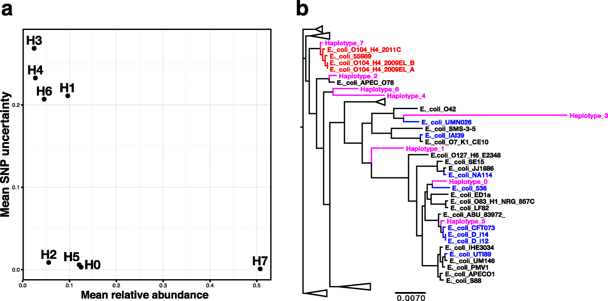

MtlMicro Meeting: December 2017
Quince et al., 2017

"DESMAN: a new tool for de novo extraction of strains from metagenome" by Quince et al. 2017
========================================================
author: Patricia Tran /MtlMICRO Meeting
date: December 6, 2017
autosize: true

WELCOME!
========================================================
Welcome to the First MtlMicro Meeting!
Thank you all for attending and for the paper suggestions.

This paper was suggested by Nicolas Tromas from the Shapiro Lab. 

ABSTRACT
========================================================

Problem:
Large multi-sample metagenomes are generated, but strain variation results in fragmentary co-assemblies
Therefore, the bins (MAGs) are can be an aggregate of closely related strains.

What DESMAN is:
a tools that identifies varients in core genes and uses co-occurence accross samples to link these variants into haplotypes and abundance profiles

How this was tested:
- in silico
- A complex 50-species 210-genome 96-samples synthetic mock data set and applied to the Tara Oceans Microbiome

The basics...What's a metagenome?
========================================================
A metagenome is a genome reconstructed (metagenome-assembled-genomes, or MAGs, or bin) from all the DNA extracted from an environmental sample.

Overview of the DESMAN pipeline
====================================

Figure 1.

Proof of concept
====================================
Tested the DESMAN pipeline on two datasets
- E.coli Outbreak = having a reference (E.coli genomes) + in silicco
- Complex environmental samples = more representative to what a environmental microbiologist would do. Using the TARA Oceans project

Mock Community
====================================
1. Binning (using Concoct, or any other de novo binning method)
  + 20 metagenomes --> 19 bins
  + Bins were merged to obtain pangenome
  + ID coding domains --> Assign to contigs --> See Add. Methods *"Identifying core genes in target species"*
    + In short: Download complete E.coli genomes from NCBI --> Use RPS-BLAST to assign to COGS --> ID COGs that are in single copy and have >95% ANI to the known E.coli strains ---> call those "SCGS"

2. Variant detection
  + Map the reads back to the SCGS to obtain sample-specific base frequencies at each positing. Use Likelihood ratio test (statistical test used for comparing the goodness of fit of two statistical models, one of which (the null model) is a special case of the other (the alternative model))
  + If the False Discovery Rate (FDR) is <10^-3 = Classify as a **variant**

3. Strain deconvolution
  + Obtain a certain X of potential variant positions in the Y SCGS
  + (here, 6044 variants in 372 SCGS)
  + **Figure 2a**
    
Mock Community (Cont.)
====================================
    
4. Comparison to existing algorithms
  + Subsample the variants and tested the programs
  + Lineage (O'Brien et al., 2014): Correctly predicted 5 strains, but 2 of them were identical, and matched a known strain. Accuracy was lower than DESMAN (76.32% vs. 99.6%)
  + ConStrains (Luo et al., 2015): Issue of insufficient coverage (despite 37-432 coverage, unlike 10.0 stated in the documentation)

5. Effect of sample number on sample inference:
  + Asking: "How many samples do I need for this to work?"
  + Subsample sample 1 to 64, as long as the relative abundances in the subsamples is ~ that of the 64 sample
  + Run DESMAN on only the subsample
  + **Figure 2b**: SNV error rate increases when sample number <= 30, but average error ~15%, even with just 10 samples. At low sample number, accuracy is very variable --> some strains will be resolved accurately, wherease others are missed completely.
- Inference of strain abundances:
  + i.e. : What's the frequency of each strain in each sample?
  + Relative frequency = proportion of coverage deriving from each strain, when the reads are mapped unto each MAG. 
  + **2c** : Predicted frequency is almost 1:1 to the real E.coli strain frequency.
  
6. Run time: pretty quick, less than 2 hours on 1 core, without parallelization. Scales linearly with sample number.

7. Gene assignment: 
  + i.e. is it good at assigning non-core genes?
  + Take the posterior mean deviance (y value of Figure 2a, for which G < 5) --> Parameters to infer the presence or absence of each genes in each strain. 
  + **Figure 2d**:(what do these colours mean?!)

DESMAN model testing using the Mock Community
====================================

Figure 2

E.coli O104:H4 outbreak
====================================
Applied the algorithm to 53 human feacal samples from the 2011 STEC O104:H4 outbreak

Starting point: 
- unknown number of exact strains present in the population nor their proportions
- We know one of these strains, from cultured isolate that was sequenced.
- Can we use DESMAN to find/predict that particular strain?

A few points:
20 samples were used because they had mean coverage of SCSG (Single core genes) greater than 5. Smaller than that is hard to deconvolute.

Validation of reconstructed strains 
====================================

Figure 3

Figure 4
====================================

Figure 5
====================================

TARA Oceans plankton microbiome survey
====================================
7.2 TB of metagenomic data, 243 samples accross 68 locations from epipelagic and mesopelagic waters globally

- No attemps to bin into MAGs in the original study
- Delmont et al., 2011 : Extracted 957 MAGs from 93 of these samples (Using CONCOCT and ANVI'O)
    + 32 of the most abundant MAGS with 75% of SCG %>% DESMAN
    + 4 Actinobacteria, 6 Bacteroidetes, 1 *Candidatus Marinimicrobia*, 1 Chloroflexi, 3 Euryarchaeota and 17 Proteobacteria

Figure 6
====================================

Open-ended discussion
====================================
Example questions to discuss:

- De novo vs. reference based?
- What is a metagenome? What is a species? Is it an operational terms? (any more useful than OTU?)
- What are the caveats of using these terms?
- In which scenarios would deconvoluting MAGs be useful? For what kind of questions?
- The method described assumed that we start with a co-assembly, and bin those contigs. Should we even use a co-assembly to begin with?
- Would this method can useful in your research?
- What binning algorithm do you use for your research? What are the pros and cons you have encountered?

Some key terms
====================================
>"We developped a full **Bayesian Model**, fitted by a **Markov Chain Monte Carlo (MCMC)** **Gibbs sampler**, to learn the strain frequencies, their **haplotypes** and allso sequencing error rates. To improve **convergence**, we initialize the Gibbs sampler using a **non-negative matrix factorisation** (NMF), or more properly **non-negative tensor factorisation (NTF)**, a method from machine learning that is equivalent to the **maximum likelihood solution**" 

(Second page of PDF, Quince et al. 2017)

Definitions
====================================
**Bayesian Model**: a graphical model that represents a set of random variables and their conditional dependencies via a directed acyclic graph.

**MCMC**: A method to sample from, and to computing expectations with high-dimensional probability distributions. Check out this video <https://www.youtube.com/watch?v=12eZWG0Z5gY> for an intro to it.

**Gibbs Sampler**: One class of algorithm (a series of well defined steps to achieve an outcome/method) that consist of generate posterior samples by sweeping through each variable (or block of variable) to sample from its conditional distibution with the remaining variables fixed to their current values (Yildirim, 2012: Bayesian Inference: Gibbs Sampling, U. of Rocherster)

**Convergence**: When the sample values have the same distribution as if they were sampled from the true posterior joint distribution (Yildirim, 2012)

Non-negative matrix factorisation:

Non-negative tensor factorisation:

**Maximum-likelihood**: The process of finding the value of one or more parameters of a model, given observations by finding the parameters values that maximized the likelihood of making the observations given the parameters. 

